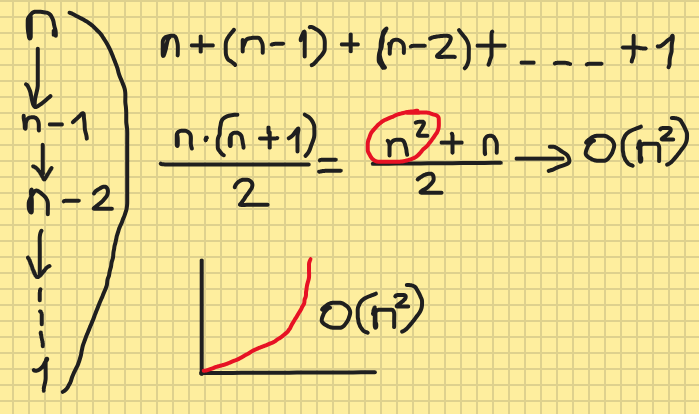

# Proje 1

## [22, 27, 16, 2, 18, 6] -> Insertion Sort

### Yukarıda verilen dizinin sort türüne göre aşamalarını yazınız.

---

**1.Aşama:** Dizi içerisindeki bütün elemanlar ***(n)*** kontrol edilerek en küçük eleman bulunur ve ilk eleman ile yeri değiştirilir. Böylece en küçük eleman başa getirilmiş olur.

|n|İlk Eleman|En Küçük Eleman|Yapılan İşlem|Güncel Dizi|
|:-:|:-:|:-:| :-: |:-:|
| 22, 27, 16, 2, 18, 6 |22|2| [*2, ..., 22, ...*]|[**2**, 27, 16, 22, 18, 6]|

**2. Aşama:** ***n - 1*** içerisindeki bütün elemanlar kontrol edilerek en küçük eleman bulunur ve ilk eleman ile yeri değiştirilir.

|n - 1|İlk Eleman|En Küçük Eleman|Yapılan İşlem|Güncel Dizi|
|:-:|:-:|:-:|:-:|:-:|
| 27, 16, 22, 18, 6 |27|6| [*..., 6, ..., 27*] |[**2, 6**, 16, 22, 18, 27]|

**3. Aşama:** ***n - 2*** içerisindeki bütün elemanlar kontrol edilerek en küçük eleman bulunur. En küçük ve ilk eleman ***16*** olduğu için yeri değiştirilmez.

|n - 2|İlk Eleman|En Küçük Eleman|Yapılan İşlem|Güncel Dizi|
|:-:|:-:|:-:|:-:|:-:|
| 16, 22, 18, 27 |16|16| [*..., 16, ...*] |[**2, 6, 16**, 22, 18, 27]|

**4. Aşama:** ***n - 3*** içerisindeki bütün elemanlar kontrol edilerek en küçük eleman bulunur ve ilk eleman ile yeri değiştirilir.

|n - 3|İlk Eleman|En Küçük Eleman|Yapılan İşlem|Güncel Dizi|
|:-:|:-:|:-:|:-:|:-:|
| 22, 18, 27 |22|18| [*..., 18, 22, ...*] |[**2, 6, 16, 18**, 22, 27]|

**5. Aşama:** ***n - 4*** içerisindeki bütün elemanlar kontrol edilerek en küçük eleman bulunur. En küçük ve ilk eleman ***16*** olduğu için yeri değiştirilmez.

|n - 4|İlk Eleman|En Küçük Eleman|Yapılan İşlem|Güncel Dizi|
|:-:|:-:|:-:|:-:|:-:|
| 22, 27 |22|22| [*..., 22, ...*] |[**2, 6, 16, 18, 22**, 27]|

**6. Aşama:** Dizi içerisindeki bütün elemanlar son elemana kadar küçükten büyüğe doğru sıralandığı için son eleman ***(27)*** en büyük eleman olur ve yeri değiştirilmez. Böylece bütün elemanlar sıralanmış olur.

[**2, 6, 16, 18, 22, 27**]

---

### Big-O gösterimini yazınız.

```
n*(n + 1) / 2 = n^2 + 1 / 2 = O(n^2)
```



---

### Time Complexity: Dizi sıralandıktan sonra 18 sayısı aşağıdaki case'lerden hangisinin kapsamına girer? Yazınız

    Average case: Aradığımız sayının ortada olması
    Worst case: Aradığımız sayının sonda olması
    Best case: Aradığımız sayının dizinin en başında olması.

[2, 6, 16, **18**, 22, 27] Average Case kapsamına girer.

---

[7, 3, 5, 8, 2, 9, 4, 15, 6] dizisinin Selection Sort'a göre ilk 4 adımını yazınız.

1. Bütün elemanlar tek tek kontrol edilerek en küçük eleman bulunur.

    |En küçük elemanın bulunması|
    |:-:|
    **n** = 7, 3, 5, 8, ***2***, 9, 4, 15, 6

2. En küçük elemanın yeri ilk eleman ile değiştirilir. İlk eleman en küçük ise yeri sabit bırakılır.

    |Sıralama işlemi|
    |:-:|
    [**7**, 3, 5, 8, **2**, 9, 4, 15, 6] => [**2**, 3, 5, 8, **7**, 9, 4, 15, 6]

3. Başa getirilen elemandan sonrası yeni aranacak yer olarak belirlenir.

    |Yeni aranacak alan|
    |:-:|
    **n- 1** = 3, 5, 8, 7, 9, 4, 15, 6

4. Belirlenen alan içerisinde ilk üç adım uygulanır.

    |En küçük elemanın bulunması|
    |:-:|
    **n - 1** = **3**, 5, 8, 7, 9, 4, 15, 6 

    |Sıralama işlemi|
    |:-:|
    |[**2**, **3**, 5, 8, 7, 9, 4, 15, 6]|

    |Yeni aranacak alan|
    |:-:|
    |**n - 2** = 5, 8, 7, 9, 4, 15, 6|

---
